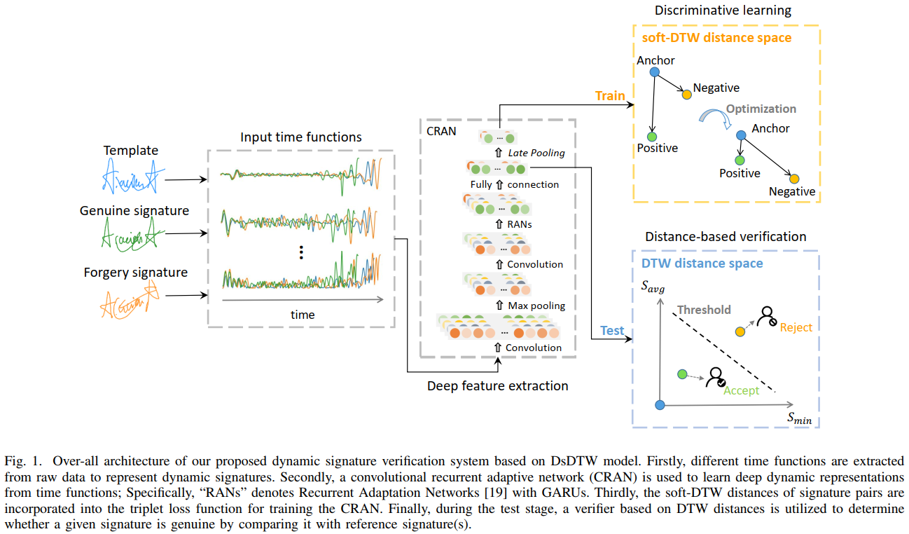
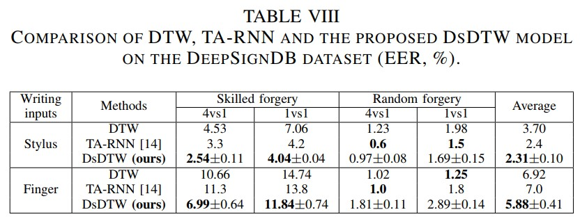
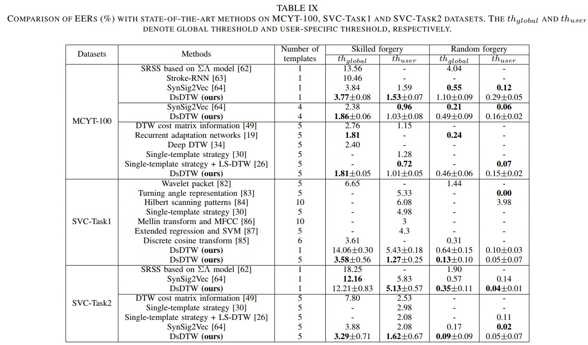
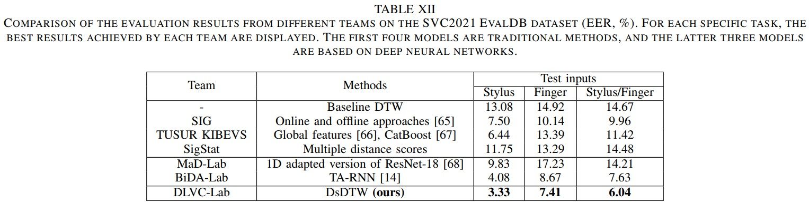

## The DsDTW method [1] for dynamic signature verification.

This repository implements a soft-DTW-based deep model for learning online signature representations. The soft-DTW was cited from Cuturi et al.'s work [3]. The model structure is based on the recurrent adaptation network in our previous work [2]. To use this repository, you should first download the DeepSignDB database [4]. If you find this repository useful, please cite our papers [1,2]. 



The proposed DsDTW achieves state-of-the-art performance on several public benchmarks, including DeepSignDB (the largest online signature dataset to date), MCYT-100, SVC-task1 and SVC-task2.




Besides, DsDTW has won first place in the ICDAR 2021 competition for online signature verification with an obvious margin.



### Pipeline 

- run.sh: Training the DsDTW models.

- evaluate_DsDTW.sh: Extracting signature feature vectors using the trained models, and verifying the signatures according to the protocol of DeepSignDB [4].

### Environment Setup

Python 3.7.5 or a later version is suggested. The package dependencies can be seen in the requirements.txt.

### References

[1] Jiang J, Lai S, Jin L, et al. DsDTW: Local Representation Learning with Deep soft-DTW for Dynamic Signature Verification[J]. IEEE Transactions on Information Forensics and Security, 2022.

[2] Lai S, Jin L. Recurrent adaptation networks for online signature verification[J]. IEEE Transactions on information forensics and security, 2018, 14(6): 1624-1637.

[3] Cuturi M, Blondel M. Soft-dtw: a differentiable loss function for time-series[C]//International conference on machine learning. PMLR, 2017: 894-903.

[4] Tolosana R, Vera-Rodriguez R, Fierrez J, et al. DeepSign: Deep on-line signature verification[J]. IEEE Transactions on Biometrics, Behavior, and Identity Science, 2021.

### Citation and Contacts

Please consider to cite our paper if you find the code useful.

```
@article{jiang2022dsdtw,
  title={DsDTW: Local Representation Learning with Deep soft-DTW for Dynamic Signature Verification},
  author={Jiang, Jiajia and Lai, Songxuan and Jin, Lianwen and Zhu, Yecheng},
  journal={IEEE Transactions on Information Forensics and Security},
  year={2022},
  publisher={IEEE}
}
```

For any questions about the codes, please contact the authors by sending emails to Prof. Jin (eelwjin@scut.edu.cn), Jiajia Jiang (jiajiajiang123@qq.com), or Songxuan Lai (eesxlai@qq.com).

### Copyright

This code is free to the academic community for research purpose only. For commercial purpose usage, please contact Dr. Lianwen Jin: eelwjin@scut.edu.cn.


